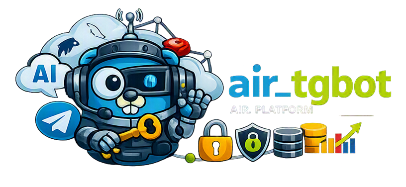

# AiR_Tgbot



[🇷🇺 Russian version](README.ru.md)


[](https://t.me/marusia_dev)

`air_tgbot` is an AiR platform microservice for running and serving Telegram bots with AI assistant support.

## User Data Protection

All user data is encrypted with an individual `MasterKey`. This key is available only through the user's password and encrypts the Telegram bot API token, dialog history, and individual bot settings. Decryption is possible only after the user authenticates in the system with their personal password. Even if the database is compromised or leaked, all user data remains inaccessible to both attackers and service administrators.

## Features

- dynamic start, stop, and restart of user Telegram bots;
- processing of text, voice messages, images, and documents;
- support for OpenAI, Mistral, and Google AI providers;
- streaming processing of assistant responses;
- CRM integration and operator handoff for conversations;
- support for long polling and Telegram webhooks;
- encrypted storage of settings in MySQL and Redis;
- configuration and master key retrieval from `AiR_ORCHESTRATOR` over gRPC;
- HTTP endpoints for bot management and Prometheus metrics;
- graceful shutdown when the application or container stops.

## Architecture

```text
Telegram
   |
   v
air_tgbot ---- MySQL
   |  \------- Redis
   |  \------- AiR_ORCHESTRATOR (gRPC)
   |  \------- AI Router (OpenAI / Mistral / Google)
   \---------- CRM / Operator / Prometheus
```

The main logic is located in `internal/telegram`. Component composition is handled in `internal/app`, data access is implemented through `internal/repository/mysql`, and HTTP handlers are located in `internal/delivery/http`.

## Technologies

Go, MySQL, Redis, gRPC, Telegram Bot API, OpenAI, Mistral, Google AI, Prometheus, Docker, and Docker Compose.

## Development

Use [`dev.yml`](dev.yml) to run the service. It connects to the external Docker networks `air_shared` and `monitoring_shared`, as well as to the following containers:

- `air_db:3306` — MySQL;
- `air_redis:6379` — Redis;
- `airorc:50051` — configuration gRPC service.

```bash
docker compose -f dev.yml up --build
```

Development mode enables debug logging, uses `localhost` as the public address, and keeps webhooks disabled. The service key is mounted from `.service_key` to `/run/secrets/service_key` as a read-only file.

## Configuration

Main environment variables:

```text
DB_HOST
DB_NAME
DB_USER
DB_PASSWORD
REDIS_ADDR
REDIS_PASSWORD
REDIS_DB
GRPC_CONFIG_HOST
SERVICE_KEY_FILE
REAL_URL
LOG_LEVEL
WEBHOOK
GLOB_USER_MODEL_TTL
```

An example service key is provided in [`.service_key.example`](.service_key.example). The secret file should not be committed to the repository.

## HTTP and Monitoring

The HTTP server listens on port `8080`.

Main routes:

```text
GET  /metrics
GET  /tgbot/available
GET  /tgbot/getname
POST /tgbot/notification
POST /tgbot/verification
POST /tgbot/adnot
POST /tgbot/enable
POST /tgbot/disable
POST /tgbot/restart
POST /open/tgbot/setwebhook
POST /open/tgbot/webhook/{token}
```

Metrics include the number and duration of message processing operations, Telegram message sending, CRM requests, bot lifecycle events, active dialogs, operator-mode dialogs, and HTTP requests.

The full descriptive contract is available in [`doc/openapi.yaml`](doc/openapi.yaml).

## Production

The production configuration is located in [`prod.yml`](prod.yml). It enables:

- webhook mode;
- `LOG_LEVEL=info` — sensitive user data is not logged;
- the domain from the `DOMAIN` variable;
- automatic container restart;
- Docker logs with limited rotation;
- connection to the shared AiR project networks.

The Dockerfile builds a static Go binary and places it in a minimal `scratch`-based runtime image.

## Related Services

- [air_common](https://github.com/ikermy/air_common) — shared library for AI microservices;
- [air_orchestrator](https://github.com/ikermy/air_orchestrator) — main orchestration service;
- [air_operator](https://github.com/ikermy/air_operator) — service for forwarding AI responses to and from operators across bot types;
- [marusia_crm](https://github.com/ikermy/marusia_crm) — integration service for external CRM systems;
- [air_logger](https://github.com/ikermy/air_logger) — event logging service with multi-user and Loki collector support.


## Related Components

- [`air_common`](https://github.com/ikermy/air_common) — shared models, AI router, database, and RPC components;
- `AiR_ORCHESTRATOR` — bot configuration and master keys;
- MySQL — user, assistant, and Telegram bot settings;
- Redis — temporary distributed state;
- CRM — operator conversations and notifications.

## License

The project is distributed under the [MIT License](LICENSE). It permits using, copying, modifying, and distributing the software provided that the license text and copyright notice are retained.

The full license text is available in [`LICENSE`](LICENSE).

## Contacts

[](https://t.me/ikermy)
